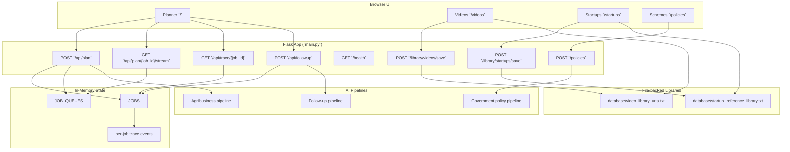
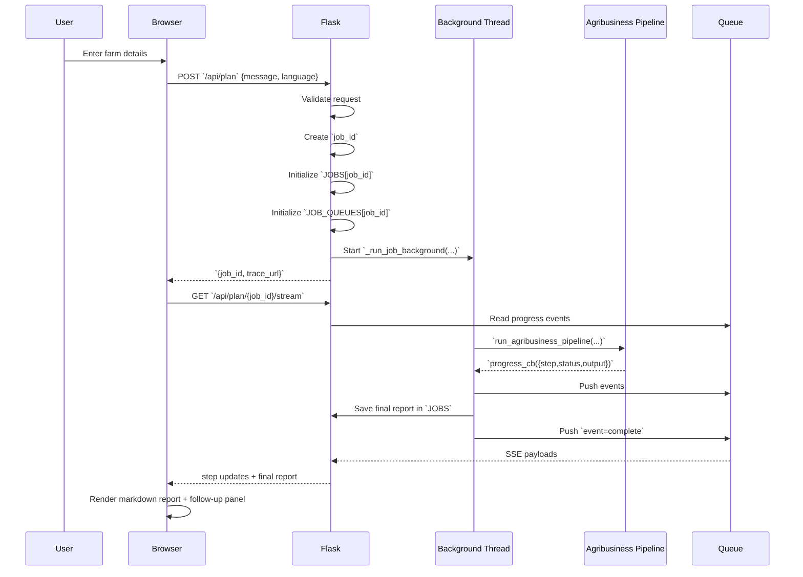
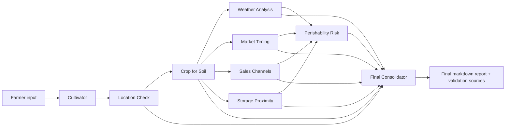
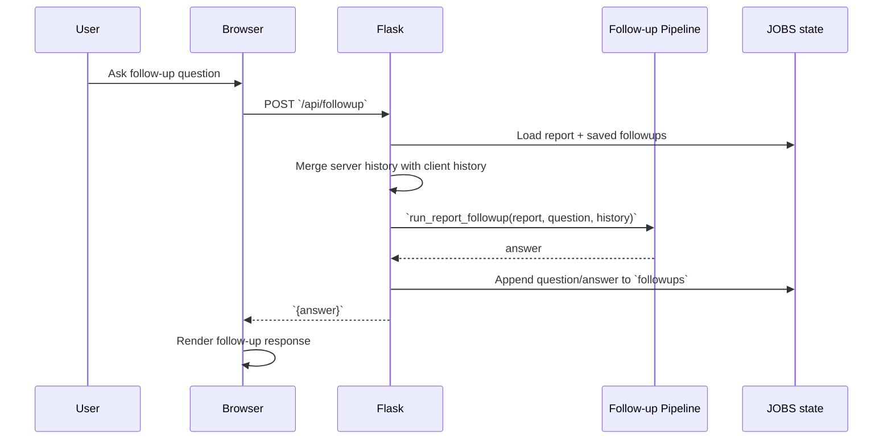
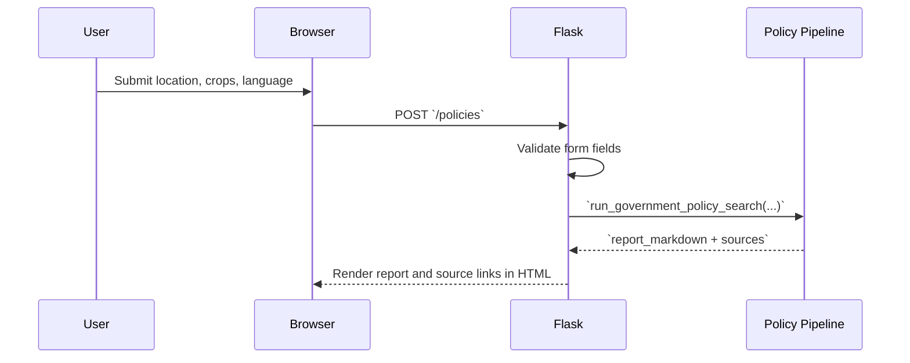
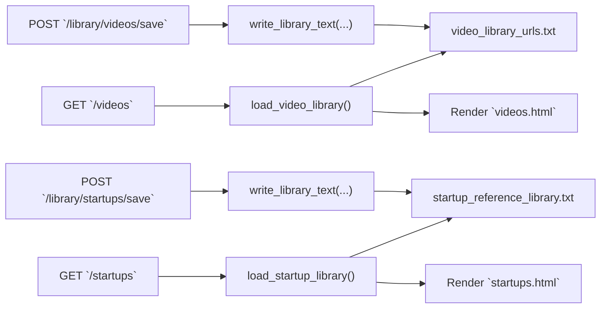
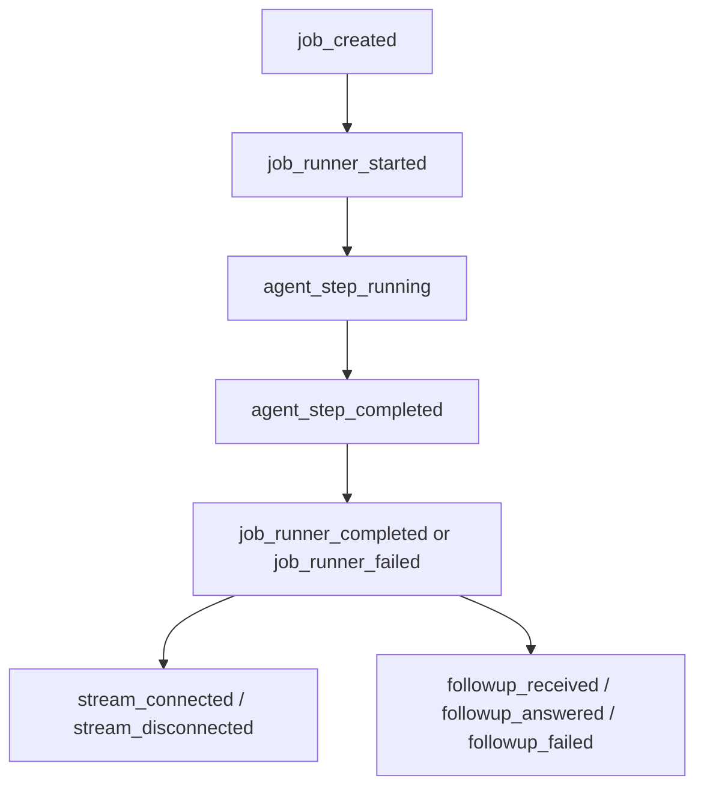

# AgriBusiness OS AI Architecture

This document describes the implemented application flow in the current codebase.
It is based on:

- `main.py`
- `static/app.js`
- `templates/*.html`
- `src/pipelines/*.py`

## 1. System Overview

## 2. Planner Flow

The planner starts in `static/app.js` when the user submits farm input from `/`.

### Planner runtime details

- `/api/plan` validates `message`, checks the agribusiness pipeline dependency, creates a job, and starts a background thread.
- `_run_job_background(...)` creates a per-thread event loop and executes the async planner pipeline.
- Step progress is pushed into `JOB_QUEUES[job_id]`.
- `_trace(...)` records job lifecycle and step timing into `JOBS[job_id]["trace"]`.
- `/api/plan/{job_id}/stream` emits SSE messages until `complete` or `error`.

## 3. Planner Agent Flow

The planner pipeline in `src/pipelines/agribusiness_pipeline.py` orchestrates the agent sequence below.

## 4. Follow-up Flow

Follow-up starts only after a planner report is available.

### Follow-up runtime details

- Server-side history is reconstructed from `JOBS[job_id]["followups"]`.
- Client-provided history is merged with server memory.
- Exact `(role, content)` duplicates are removed.
- The merged window is capped at 40 turns before calling the follow-up pipeline.

## 5. Policy Search Flow

The schemes page is a classic form POST flow rather than SSE.

### Policy runtime details

- Missing `location` or `crops` stays on the same page and shows a validation message.
- The server creates a temporary event loop for the async policy pipeline.
- `policy_report` and `policy_sources` are rendered directly into `templates/policies.html`.

## 6. Resource Library Flows

The video and startup pages are file-backed content views.

### Library runtime details

- Video entries support either:
  - `Title | URL`
  - `URL`
- Startup entries support:
  - `Startup Name | Leverage | Description | URL`
- Save routes redirect back to the page with `?saved=1` on success.
- Save routes redirect with `?error=...` on file-system write errors.

## 7. Traceability Model

Trace data is stored in memory with the job record.

The trace endpoint returns:

- `status`
- `error`
- `event_count`
- `events`
- `step_metrics`

## 8. Dependency Loading Strategy

The app lazy-loads runtime pipeline callables through `_load_runtime_callable(...)`.

This matters because:

- `/videos` and `/startups` can render without AI dependencies installed.
- `/api/plan`, `/api/followup`, and `/policies` fail gracefully with a clear dependency error if the active environment is missing required AI packages.

## 9. Test Coverage Added

Formal flow coverage now lives in:

- `test_app_flows.py`
- `test_resource_libraries.py`

Covered flows:

- index page
- health endpoint
- video library read/write flow
- startup library read/write flow
- planner create job flow
- planner SSE stream flow
- planner trace flow
- follow-up validation and success/error flows
- policy form validation and success/error flows
- dependency-missing failure paths

## 10. Main Runtime Entry Points

- Web app entry: `main.py`
- WSGI entry: `wsgi.py`
- Planner frontend logic: `static/app.js`
- Planner pipeline: `src/pipelines/agribusiness_pipeline.py`
- Follow-up pipeline: `src/pipelines/report_followup_pipeline.py`
- Policy pipeline: `src/pipelines/government_policy_pipeline.py`
