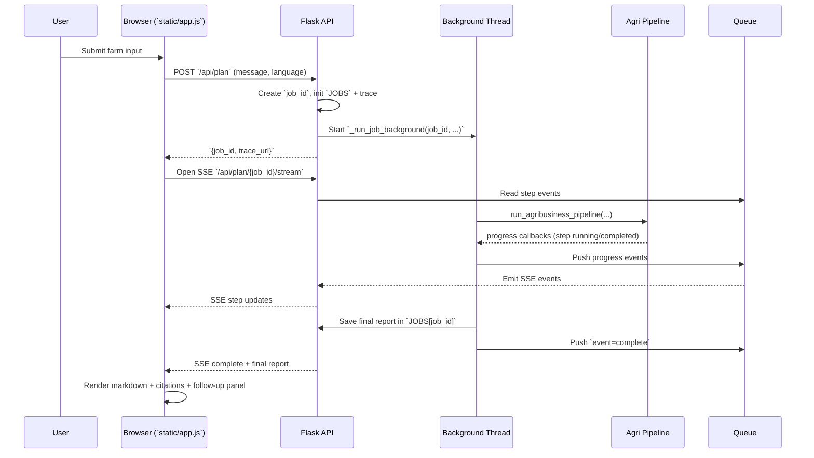
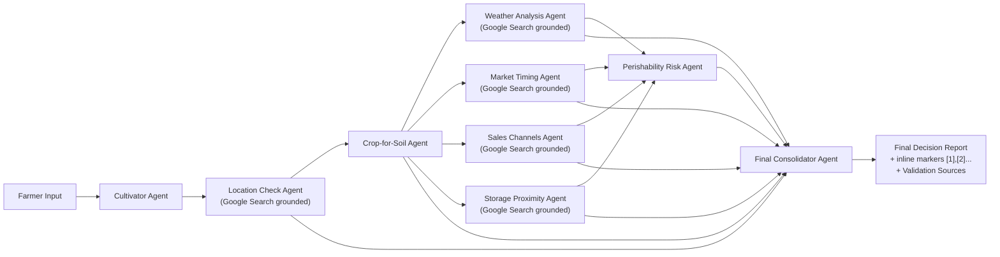

# AgriBusiness OS Architecture

## 1) System Overview

```mermaid
flowchart TB
    subgraph UI["Browser UI (Templates + JS/CSS)"]
        IDX["Planner Page `/`"]
        VID["Video Library `/videos`"]
        STP["Startup References `/startups`"]
        POL["Schemes Search `/policies`"]
    end

    subgraph APP["Flask App (`main.py`)"]
        API1["POST `/api/plan`"]
        API2["SSE `/api/plan/{job_id}/stream`"]
        API3["POST `/api/followup`"]
        API4["GET `/api/trace/{job_id}`"]
        API5["POST `/library/videos/save`"]
        API6["POST `/library/startups/save`"]
        API7["POST `/policies`"]
    end

    subgraph STATE["App State"]
        JOBS["`JOBS` (report, followups, trace)"]
        QUEUES["`JOB_QUEUES` (SSE progress)"]
    end

    subgraph DATA["File Data"]
        VLIB["`database/video_library_urls.txt`"]
        SLIB["`database/startup_reference_library.txt`"]
    end

    subgraph AI["AI + Search"]
        AGRI["Agri Pipeline"]
        FUP["Follow-up Pipeline"]
        GOV["Schemes Pipeline"]
        GCLI["Google GenAI Client"]
        GSRCH["Google Search Grounding Tool"]
    end

    IDX --> API1
    IDX --> API2
    IDX --> API3
    IDX --> API4
    POL --> API7
    VID --> API5
    STP --> API6

    API1 --> JOBS
    API1 --> QUEUES
    API2 --> QUEUES
    API3 --> JOBS
    API4 --> JOBS
    API5 --> VLIB
    API6 --> SLIB

    API1 --> AGRI
    API3 --> FUP
    API7 --> GOV

    AGRI --> GCLI
    FUP --> GCLI
    GOV --> GCLI
    GOV --> GSRCH
    AGRI --> GSRCH
```

## 2) Planner Runtime Flow (SSE + Background Job)



## 3) Multi-Agent Orchestration (Planner)



## 4) Follow-up, Memory, and Traceability

```mermaid
flowchart TD
    FQ["POST `/api/followup`"] --> H1["Read `JOBS[job_id].followups`"]
    FQ --> H2["Merge with client history"]
    H1 --> HM["Bounded merged history window"]
    H2 --> HM
    HM --> RF["run_report_followup(report + history + question)"]
    RF --> ANS["Return answer"]
    ANS --> SAVE["Append to `JOBS[job_id].followups`"]

    TR["`_trace(...)` events"] --> STORE["`JOBS[job_id].trace`"]
    STORE --> TAPI["GET `/api/trace/{job_id}`"]
    TAPI --> MET["Step metrics + event timeline"]
```

## 5) Feature Mapping

- Planner business-plan build: `/api/plan` + SSE stream.
- Follow-up Q&A (text/voice in UI): `/api/followup`.
- Video library management: `/videos` + `/library/videos/save`.
- Startup references management: `/startups` + `/library/startups/save`.
- Government schemes search: `/policies` (Google-search-grounded generation).
- Validation links/citations:
  - Inline citation markers in report body.
  - Clickable references in **Validation Sources**.
- Traceability:
  - `trace_url` returned by `/api/plan`.
  - Detailed timeline from `/api/trace/{job_id}`.

## 6) Configuration Surface (Key Env Vars)

- `GEMINI_API_KEY` or `GOOGLE_API_KEY`: model auth.
- `GEMINI_MODEL_ID` / `GOOGLE_GEMINI_MODEL`: model selection.
- `TRACE_MAX_EVENTS`: max per-job trace events kept in memory.
- `TRACE_INCLUDE_INPUT_PREVIEW`:
  - `0` (default): avoids input preview in traces.
  - `1`: includes short input preview for debugging.

